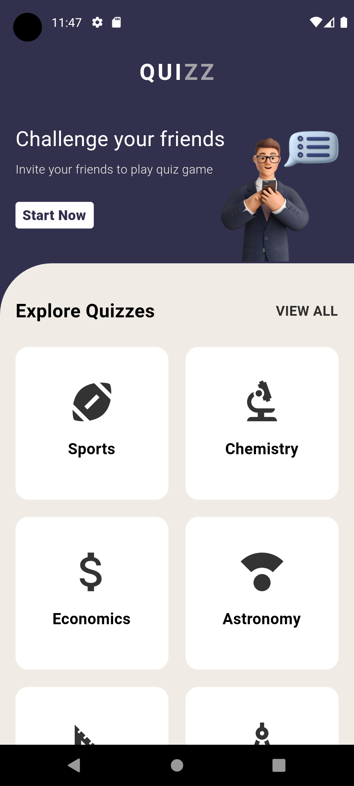
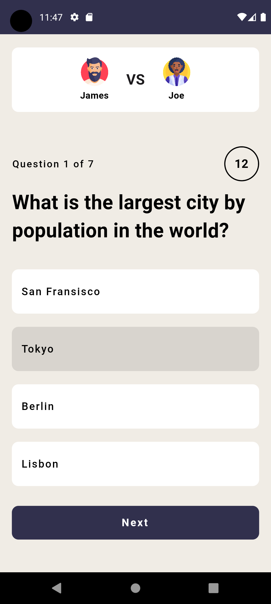

# Quiz App UI

## Description

This project is a Flutter UI implementation of a Quiz App. It features an intuitive and visually appealing interface for users to engage with quizzes.

## Screenshots

## Installation

To run this project locally, make sure you have Flutter installed. Then, follow these steps:

1. Clone the repository: `git clone https://github.com/yoni-tad/quiz-app-ui.git`
2. Navigate to the project directory: `cd quiz-app-ui`
3. Run `flutter pub get` to install the dependencies.
4. Connect your device or start an emulator.
5. Run the app: `flutter run`

## Features

- Browse various quiz categories and topics.
- Participate in quizzes with interactive questions and options.
- Result Page.

## Contributing

Contributions are welcome! If you'd like to contribute to this project, please follow these steps:

1. Fork the repository.
2. Create a new branch: `git checkout -b my-new-feature`
3. Make your changes and commit them: `git commit -am 'Add some feature'`
4. Push to the branch: `git push origin my-new-feature`
5. Submit a pull request.

## License

This project is licensed under the [MIT License](LICENSE).

## Contact

For any questions or suggestions, feel free to reach out to me at [yonitad2404@example.com](mailto:yonitad2404@example.com). You can also find me on [LinkedIn](https://www.linkedin.com/in/yoni-tad/).
